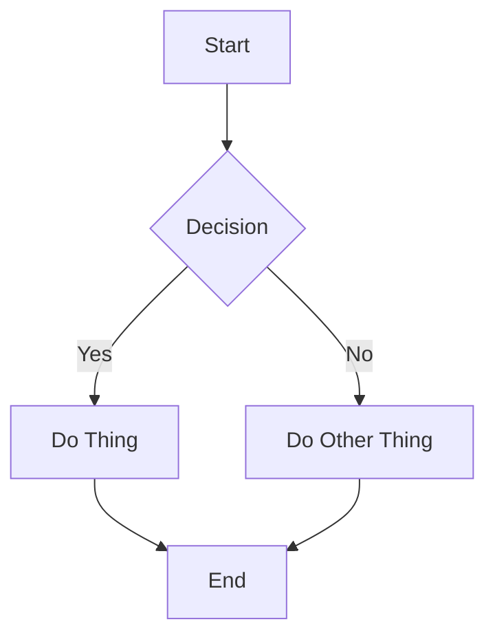
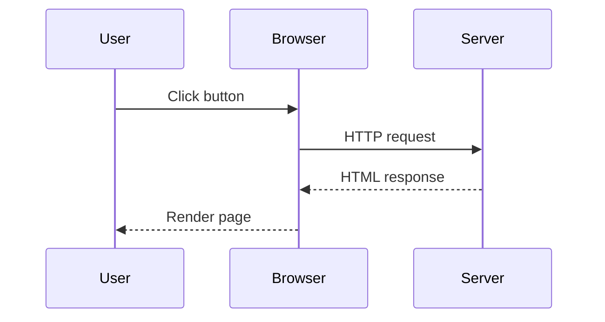
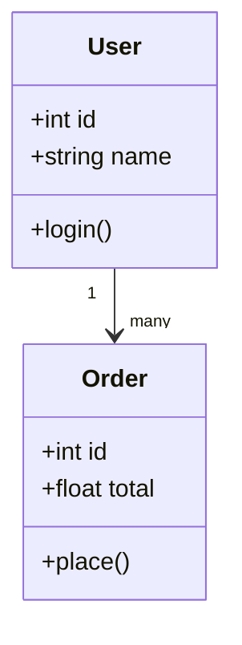
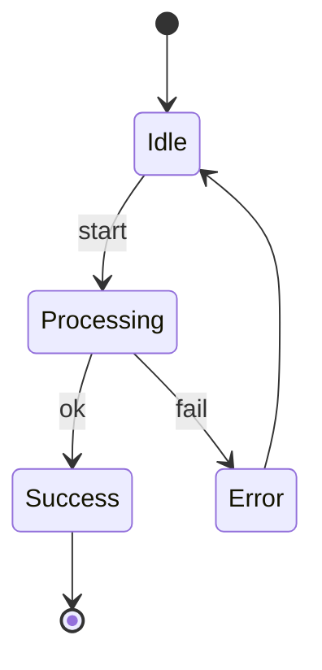
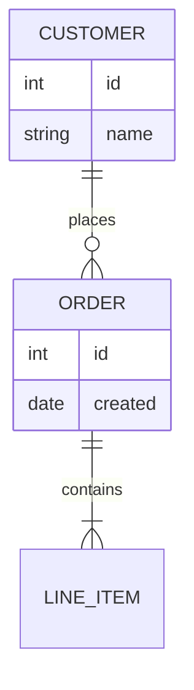
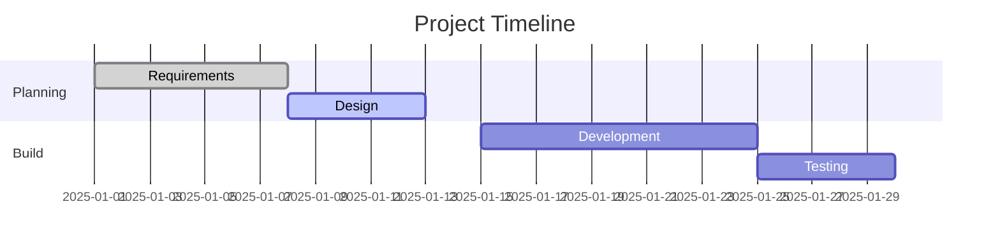

# Mermaid Diagrams

This file shows **common Mermaid diagrams** that render natively in **GitHub Markdown** and can also be rendered on a **web server** using Mermaid.js.

> GitHub automatically renders Mermaid blocks inside fenced code blocks marked as `mermaid`.

---

## Flowchart



---

## Sequence Diagram



---

## Class Diagram



---

## State Diagram



---

## Entity Relationship Diagram (ERD)



---

## Gantt Chart



---

## Shapes ##
((Circle)) - Used for start/end  
Often means initialisation, entry point, or setup phase  
{{Hexagon}} - Represents a preparation step  

Syntax	Shape	Typical meaning  
( )	Rounded	Process  
(( ))	Circle	Start / End  
[ ]	Rectangle	Action  
{ }	Diamond	Decision  
{{ }}	Hexagon	Preparation / Build  
[/ /]	Parallelogram	Input / Output  

## GitHub-Friendly Notes

* Must use fenced blocks: ` ```mermaid `
* No external JS needed on GitHub
* Renders in:

  * GitHub repo viewer
  * GitHub PRs
  * GitHub Pages


