# Mermaid Diagrams

This file shows **common Mermaid diagrams** that render natively in **GitHub Markdown** and can also be rendered on a **web server** using Mermaid.js.

> GitHub automatically renders Mermaid blocks inside fenced code blocks marked as `mermaid`.

## How
1. Choose Diagram - see below
2. Add links e.g.
3. Color
4. Notes

2. Links
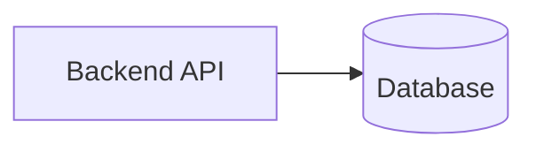
3. Add colour
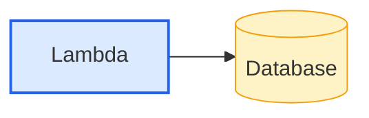
Class-based styling (recommended)
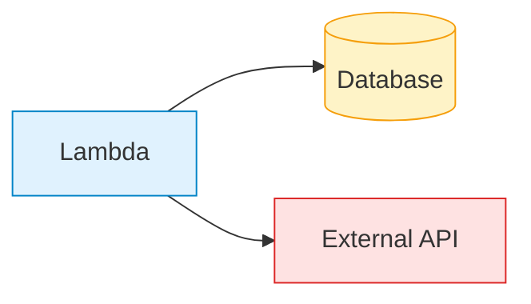

4. Notes
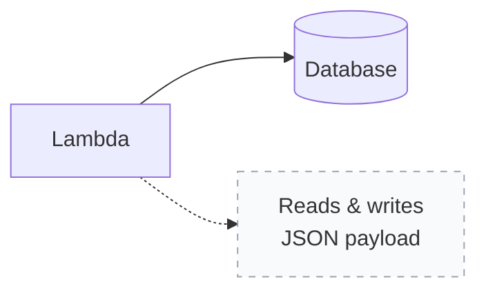
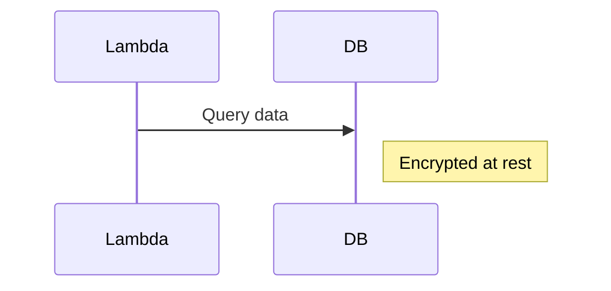

5. Subgraph
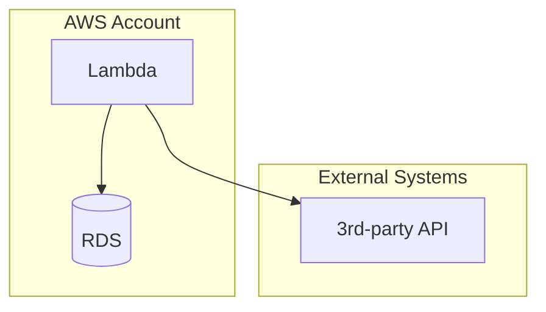
    
---
1. Flowchart  
1ai Flowchart LR (Left Right)
1b Flowchart TB (Top Bottom)
1c flowchart LR (Left Right)
1d Flowchart TD (top Bottom)
3. State

## 1 Flowchart
### 1a Flowchart LR

Best for:
* High-level system logic
* Request flows
* Dev / prod pipelines
  
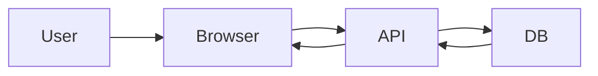
Architectural lens: How things move   
```mermaid
flowchart LR
    User -->|data| WebApp
    WebApp -->|json| API
    API -->|sql| Database
  ```  
Architectural lens: What data moves where
### 1c Flowchart TB
flowchart TB
Mermaid doesn’t have native C4, but flowcharts map perfectly.

System / Container View
```mermaid
flowchart TB
    User --> WebApp
    WebApp --> API
    API --> Database
```
Component View
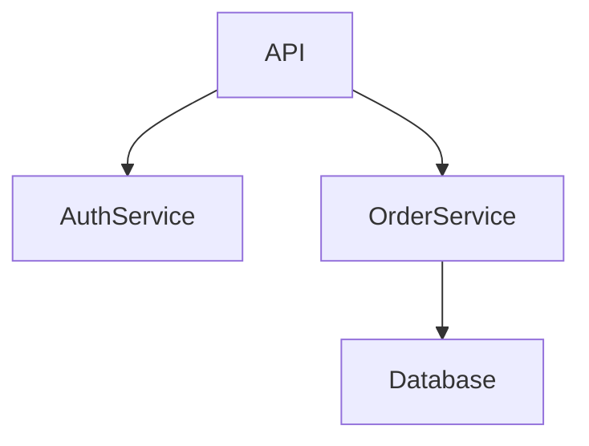
### Deployment Diagram — Infrastructure Architecture

Best for:
* Cloud layouts
* Environments
* Nodes & hosting
  
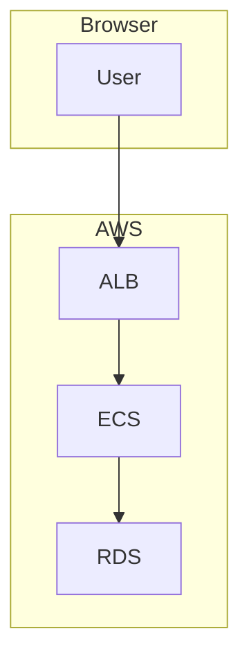

Architectural lens: Structure at different zoom levels

---
### Flowchart LR
Architectural lens: Separation of concerns  
Best for:
* Internal services
* Modules
* Responsibilities
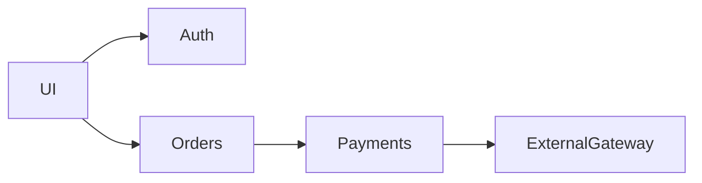
### 1d Flowchart TD

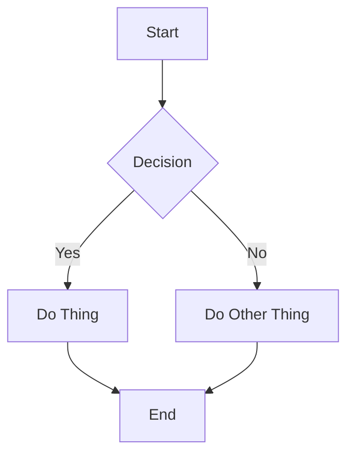
## 2. Sequence Diagram
### 2A . Sequence Diagram - 
#### API calls

Auth flows

Request/response timing
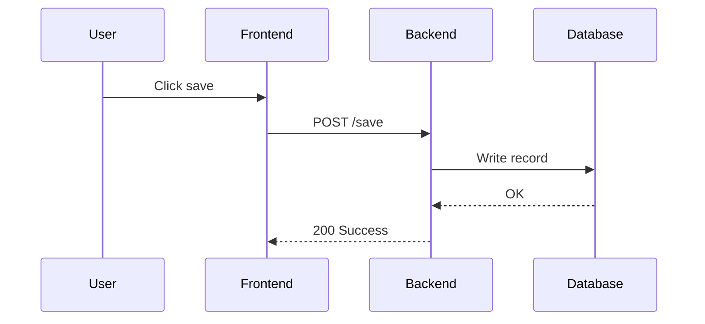
Architectural lens: Who talks to whom, and when

## 3. State Diagram
stateDiagram-v2
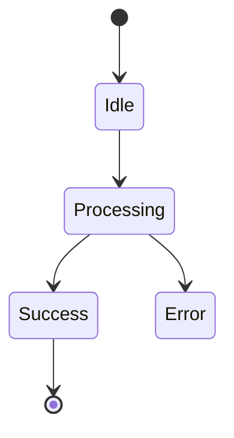
Architectural lens: How systems change state
#### Client server
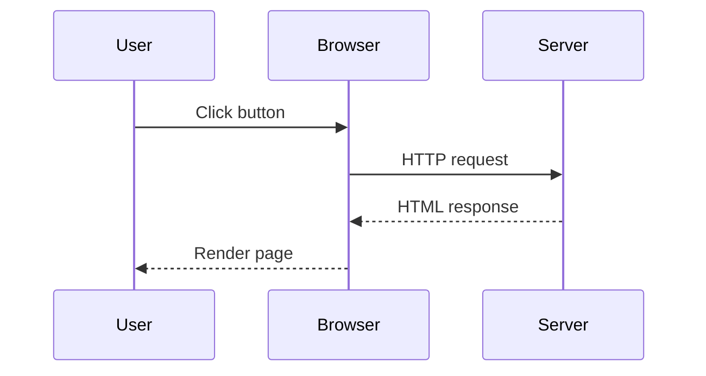

---

## Class Diagram

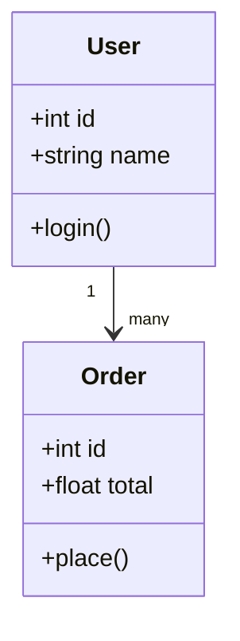

---

## State Diagram

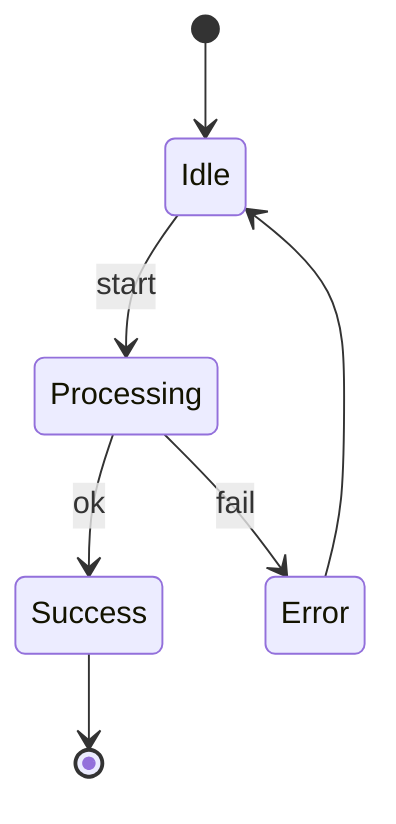

---

## Entity Relationship Diagram (ERD)

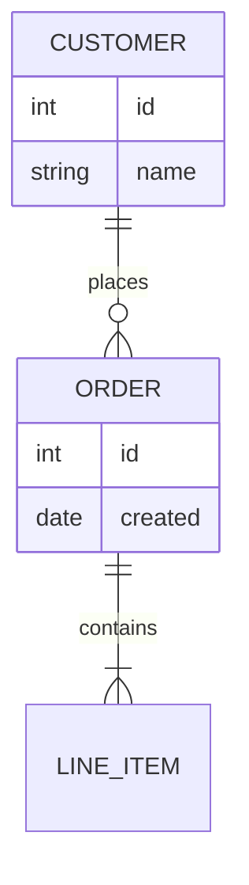

---

## Gantt Chart

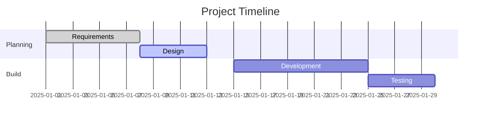

---


## GitHub-Friendly Notes

* Must use fenced blocks: ` ```mermaid `
* No external JS needed on GitHub
* Renders in:

  * GitHub repo viewer
  * GitHub PRs
  * GitHub Pages


