## Shapes ##
((Circle)) - Used for start/end  
Often means initialisation, entry point, or setup phase  
{{Hexagon}} - Represents a preparation step  

Syntax	Shape	Typical meaning  
( )	Rounded	Process  
(( ))	Circle	Start / End  
[ ]	Rectangle	Action  
{ }	Diamond	Decision  
{{ }}	Hexagon	Preparation / Build  
[/ /]	Parallelogram	Input / Output  
[()]	Database	Data


## Lines
A --> Solid
A -.-> Dashed
A ==> Thick line
A -.- Dotted line (no arrow)
A -->|HTTPS JSON| B
A -.->|Async event| B

Add a class  
:::sync
:::async

A:::compute    - styles the node
A --> B:::sync - styles the line

Style by link class (cleaner, scalable)
```mermaid
flowchart LR
    A --> B:::sync
    A -.-> C:::async

    classDef sync stroke:#2563eb,stroke-width:2px
    classDef async stroke:#dc2626,stroke-dasharray:5 5

nodes
style A fill:#e0f2fe,stroke:#0284c7,stroke-width:2px,color:#0f172a

Available properties
* fill
* stroke
* stroke-width
* stroke-dasharray
* color (text)
* opacity

A:::compute  
B:::data  
C:::external  

classDef compute fill:#e0f2fe,stroke:#0284c7  
classDef data fill:#fef3c7,stroke:#f59e0b  
classDef external fill:#fee2e2,stroke:#dc2626  

✔ Reusable
✔ Semantic
✔ Maintainable

```

| Style        | Meaning              | Example         |
| ------------ | -------------------- | --------------- |
| Solid arrow  | Synchronous call     | REST / DB query |
| Dashed arrow | Asynchronous         | Events, queues  |
| Thick arrow  | Critical path        | Auth, billing   |
| Dotted line  | Logical relationship | Dependency      |
| No arrow     | Association          | Grouping        |


##Colours

## Example
Combined Example (Clear & Expressive)

```mermaid
flowchart LR
    User[👤 User]
    Lambda[⚡ Lambda]
    DB[(🗄️ DB)]
    API[🌐 External API]

    User -->|Request| Lambda:::sync
    Lambda -->|SQL| DB:::sync
    Lambda -.->|Async call| API:::async

    classDef sync stroke:#2563eb,stroke-width:2px
    classDef async stroke:#dc2626,stroke-dasharray:5 5
```

## Critical Path Highlighting

Perfect for:
* Performance discussions
* Failure analysis
* Reviews

## Line Meaning Legend (Recommended Pattern)
Add a small legend inside the diagram.

    style Solid fill:none,stroke:#2563eb  
    style Dashed fill:none,stroke:#dc2626,stroke-dasharray:5 5  
    style Thick fill:none,stroke:#16a34a,stroke-width:4px  
    
classDef sync stroke:#2563eb,stroke-width:2px  
    classDef async stroke:#dc2626,stroke-dasharray:5 5   

# Hiding
1. Best Option

2. Hiding Links

   3. Spacer Nodes

4. Hiding Labels but Keeping Shapes
```mermaid
flowchart LR
    A --> spacer --> B

    spacer[""]:::hidden

    classDef hidden fill:none,stroke:none
```
