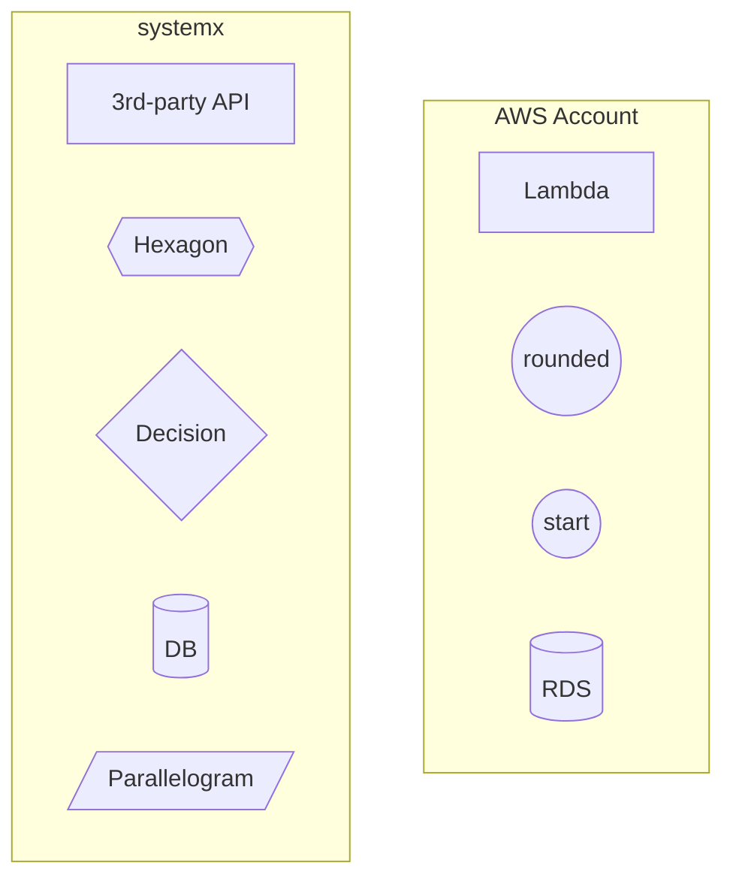

## Shapes ##
((Circle)) - Used for start/end  
Often means initialisation, entry point, or setup phase  
{{Hexagon}} - Represents a preparation step  

Syntax	Shape	Typical meaning  
( )	Rounded	Process  
(( ))	Circle	Start / End  
[ ]	Rectangle	Action  
{ }	Diamond	Decision  
{{ }}	Hexagon	Preparation / Build  
[/ /]	Parallelogram	Input / Output  
[()]	Database	Data

